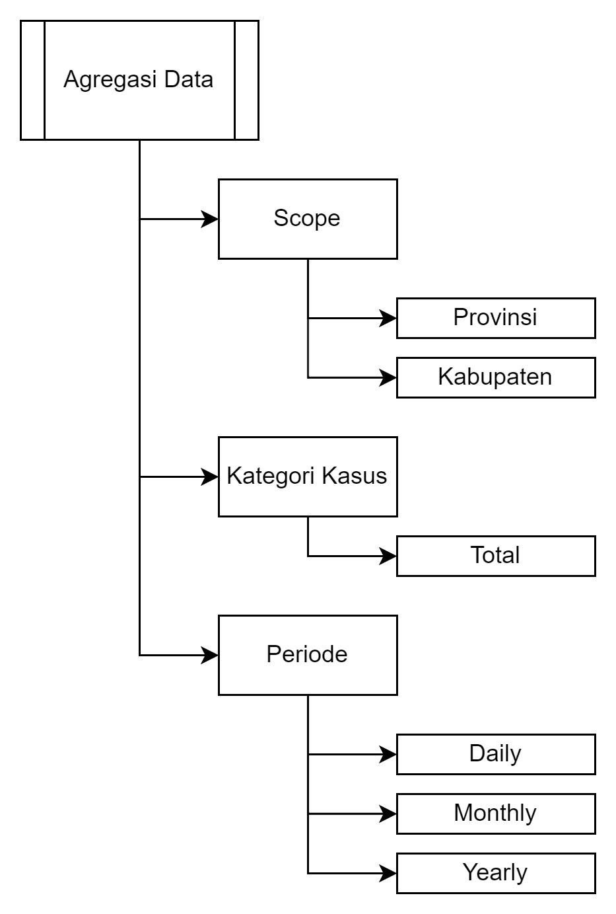

# Pikobar-ETL-using-Airflow
ETL from Pikobar to the PostgreSQL database with the help of Airflow
## Project Descriptive
In this project, an end-to-end Extract Transform Load (ETL) pipeline was created using Airflow. The data used is data on COVID-19 cases from the Pusat Informasi dan Koordinasi COVID-19 Jawa Barat (PIKOBAR). Data from PIKOBAR is stored in MySQL (staging area) then aggregated and stored in PostgreSQL. 

## Project Data
The data will be used from PIKOBAR. The API endpoint of PIKOBAR is `covid19-public.digitalservice.id`. The rquest method is `GET`. It contains:

    {
      "status_code": 200,
      "data": {
      "metadata": {
      "last_update": null
    },
      "content": [
      {
        "tanggal": "2020-08-05",
        "kode_prov": "32",
        "nama_prov": "Jawa Barat",
        "kode_kab": "3204",
        "nama_kab": "Kabupaten Bandung",
        "SUSPECT": 2210,
        "CLOSECONTACT": 274,
        "PROBABLE": 26,
        "suspect_diisolasi": 31,
        "suspect_discarded": 2179,
        "closecontact_dikarantina": 0,
        "closecontact_discarded": 274,
        "probable_diisolasi": 0,
        "probable_discarded": 0,
        "CONFIRMATION": 0,
        "confirmation_sembuh": 0,
        "confirmation_meninggal": 0,
        "suspect_meninggal": 0,
        "closecontact_meninggal": 0,
        "probable_meninggal": 26
      }
      ]
    }
    }
    
Aggregation will be done to find out the number of COVID-19 cases by division based on:
- Scope
- Case Category
- Period (Time)

