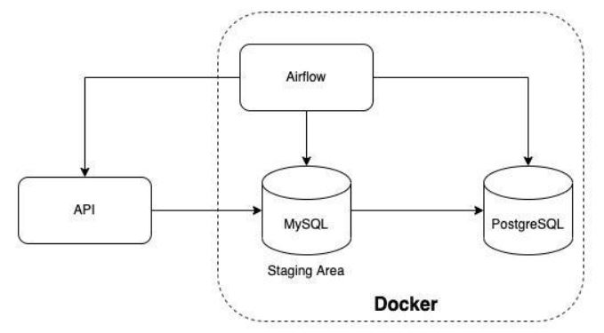
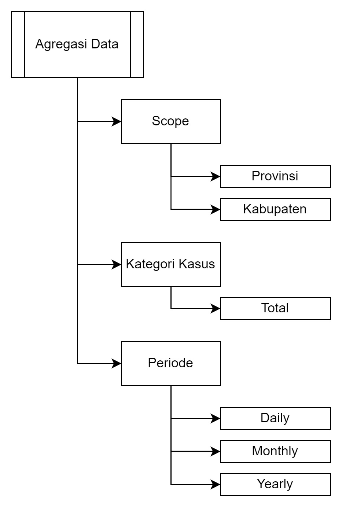
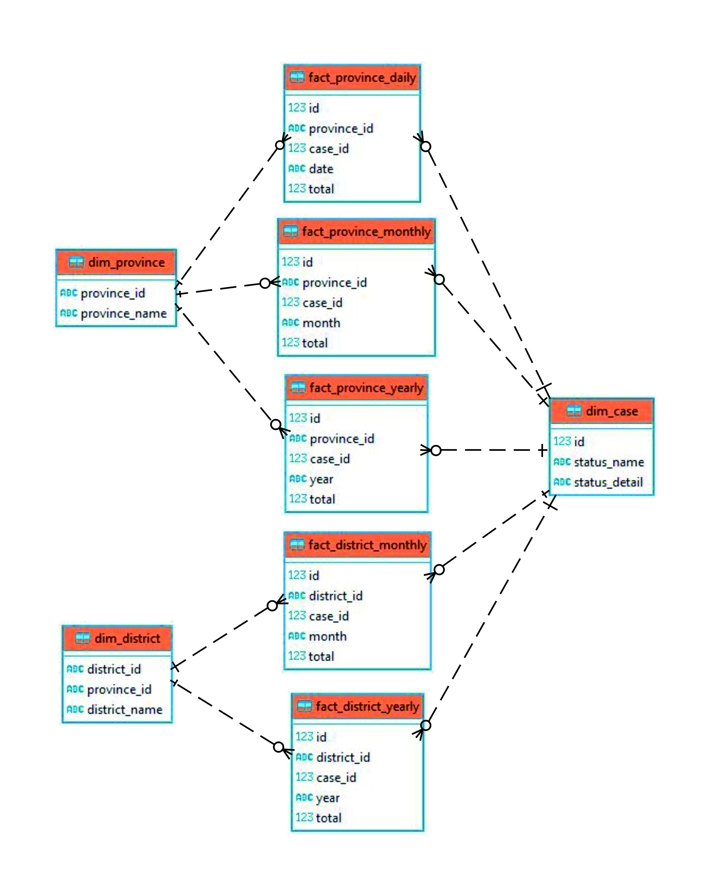
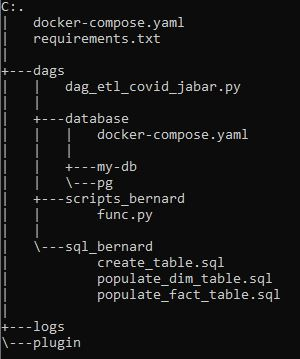
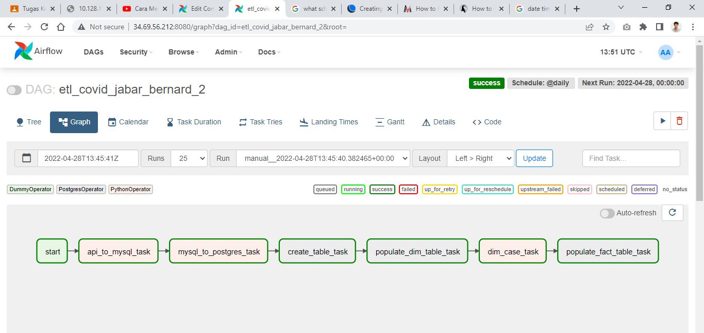
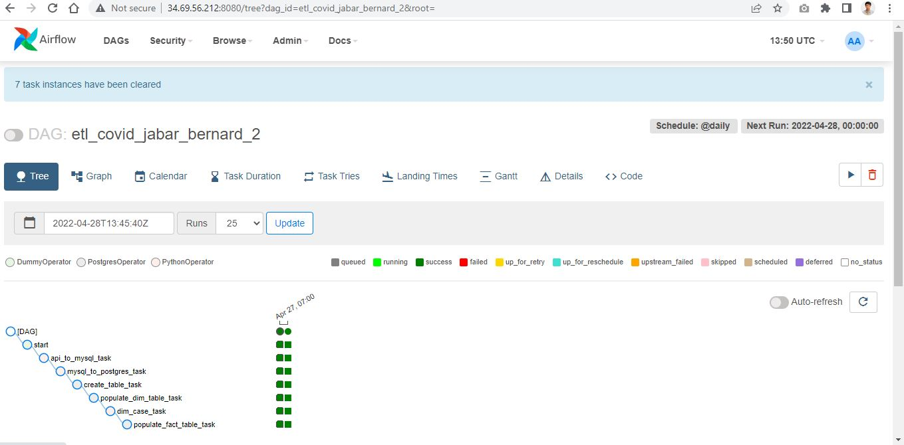
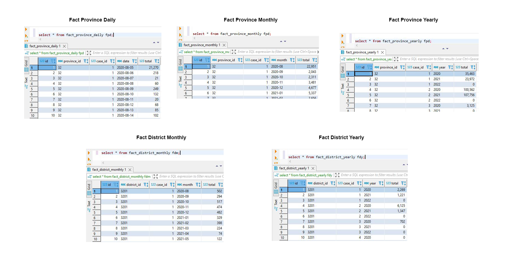

# Pikobar-ETL-using-Airflow
ETL from Pikobar to the PostgreSQL database with the help of Airflow
## Project Descriptive
In this project, an end-to-end Extract Transform Load (ETL) pipeline was created using Airflow. The data used is data on COVID-19 cases from the Pusat Informasi dan Koordinasi COVID-19 Jawa Barat (PIKOBAR). Data from PIKOBAR is stored in MySQL (staging area) then aggregated and stored in PostgreSQL. 

## Project Data
The data will be used from PIKOBAR. The API endpoint of PIKOBAR is `covid19-public.digitalservice.id`. The rquest method is `GET`. It contains:

    {
      "status_code": 200,
      "data": {
      "metadata": {
      "last_update": null
    },
      "content": [
      {
        "tanggal": "2020-08-05",
        "kode_prov": "32",
        "nama_prov": "Jawa Barat",
        "kode_kab": "3204",
        "nama_kab": "Kabupaten Bandung",
        "SUSPECT": 2210,
        "CLOSECONTACT": 274,
        "PROBABLE": 26,
        "suspect_diisolasi": 31,
        "suspect_discarded": 2179,
        "closecontact_dikarantina": 0,
        "closecontact_discarded": 274,
        "probable_diisolasi": 0,
        "probable_discarded": 0,
        "CONFIRMATION": 0,
        "confirmation_sembuh": 0,
        "confirmation_meninggal": 0,
        "suspect_meninggal": 0,
        "closecontact_meninggal": 0,
        "probable_meninggal": 26
      }
      ]
    }
    }
    
Aggregation will be done to find out the number of COVID-19 cases by division based on:
- Scope
- Case Category
- Period (Time)

For the aggregation data is possible, the PIKOBAR data will be divided into the schema with fact and dimension table, as follows:

Fact Table:
- fact_province_monthly
- fact_province_daily
- fact_province_yearly
- fact_district_monthly
- fact_district_yearly

Dimension Table:
- dim_province
- dim_case
- dim_district

The Entity Relationship Diagram (ERD) for this project will be:

## Project File Structure
In this project the file structure contains:
- dag_etl_covid_jabar as DAG file in Airflow
- The DAG file will run the ETL task from API to PostgreSQL
- ETL task will consist python_operator in the `func.py` and postgres_operator in `sql_bernard` file

While the `docker-compose.yaml` file for database and airflow used:
- MySQL:5.7
- PostgreSQl:14.1
- Apache Airflow Packaged by [Bitnami](https://github.com/bitnami/bitnami-docker-airflow)

## Airflow DAG
This project worklow are started with the `dummy_operator`. Then the python_operator will extract and load the data from the PIKOBAR API to the staging area database (MySQL) database. After that the staged area data will be loaded in the final database (PostgreSQL) as warehouse data. Before transformed as agregate data, the warehouse data will be divided as fact table and dimension table. Using the schema the agregated data is formed.

You can see the running DAG in the tree view. Here, the DAG is run in the April 27 2022 and running until April 28 2022. The DAG is running daily.

## Result
The result of this project are reports that consists aggregation data from the PIKOBAR. The data can be accessed via final database (PostgreSQL). The snipped result data are here:

## Notes
The notes for this project:
- This project is delivered as final project to Digital Skola Bootcamp. They are providing a great resource to study the data engineering and other data related topic. Thank you for the asssistance in this project and the bootcamp for the last three months. You can visit their website [here](https://www.digitalskola.com/).
- You can also see the Power Point (PPT) version of this read.me [here](https://github.com/evankanigara/Pikobar-ETL-using-Airflow/blob/main/ppt/Final%20Project%20Digital%20Skola%20-%20Bernard.pdf).

## Contact
- LinkedIn: [Bernard Evan Kanigara](https://www.linkedin.com/in/bernard-evan-kanigara/)
- Email: bernardevankanigara@gmail.com

Thank you!

